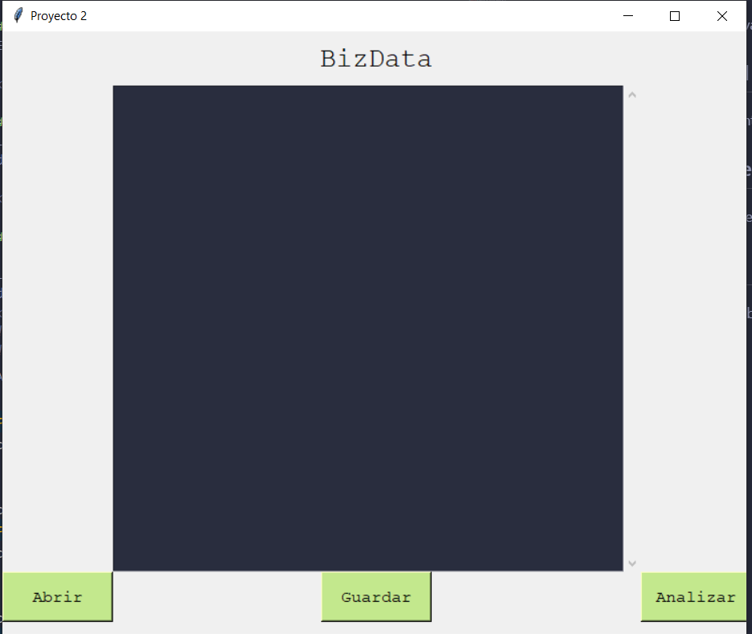
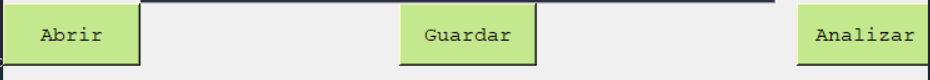
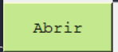
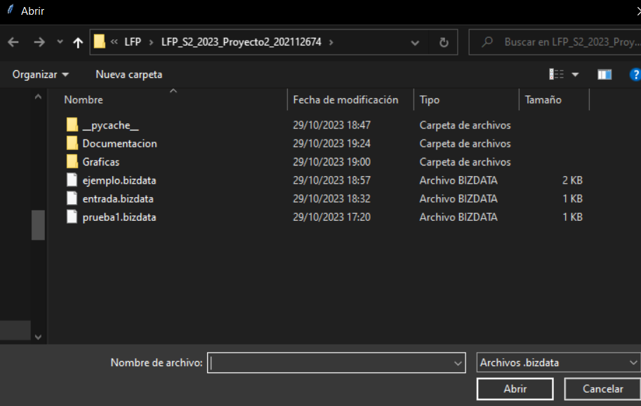
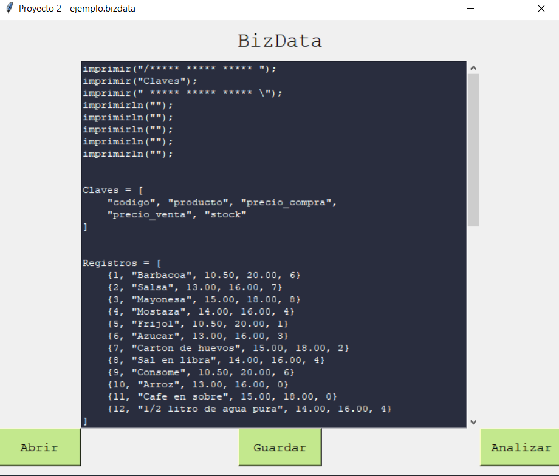
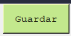
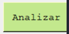
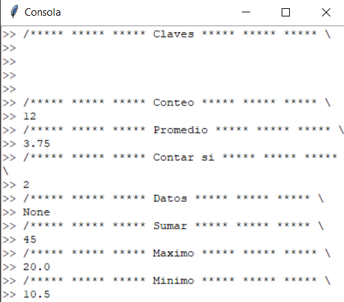
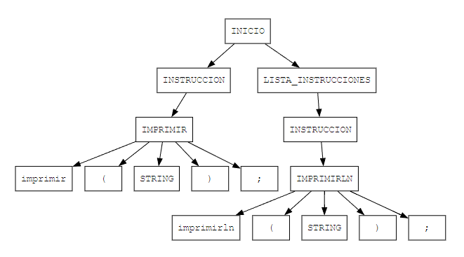

# Proyecto 2 - Manual de Usuario
Alvaro Gabriel Ramirez Alvarez - 202112674

## Pantalla Principal
El usuario deberá elegir entre las opciones desplegadas.

## Botones de Opciones
La barra de opciones presentan que se va usar en el panel de codigo.

## Abrir

La opcion **Abrir** permite abrir un archivo .bizdata para desplegarlo en el panel de codigo.

## Guardar

Guarda los cambios del archivo.bzdata o crear uno nuevo con el botón **Guardar** como .bzdata

## Analizar

**Analizar** Realiza las instrucciones dentro del archivo bizdata

Cargando también la consola con las respuestas

## Salir

Finalizado el programa crea el Árbol de derivación generado en la lectura del código fuente utilizando Graphviz. 

<!--  -->